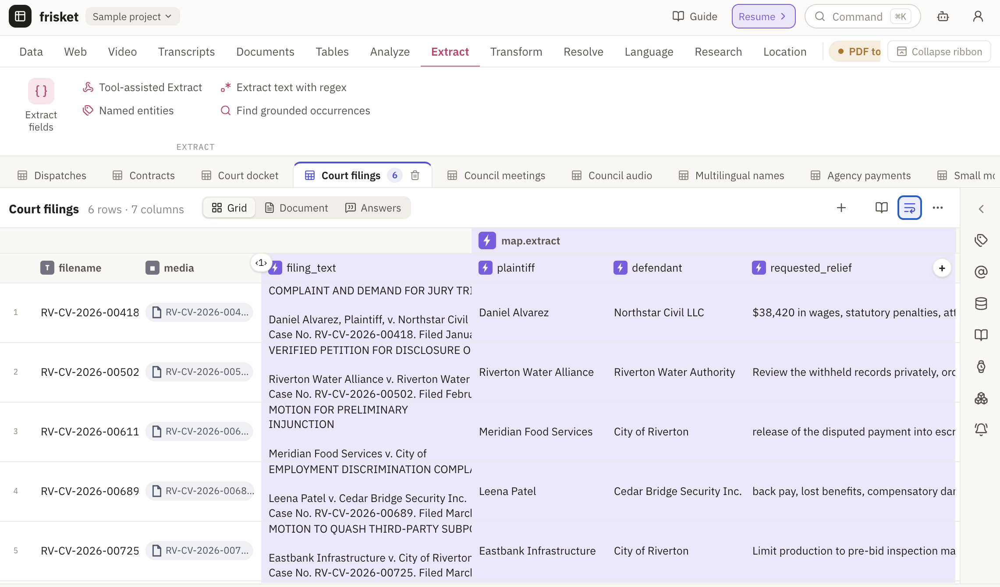

# Frisket

I wanted a spreadsheet that did AI things for investigative journalism. The NYT [made one for itself](https://www.niemanlab.org/2026/02/how-the-new-york-times-uses-a-custom-ai-tool-to-track-the-manosphere/), so I made one for the rest of us. Use Frisket to analyze zillions of documents, decades of audio, centuries of video, all in a friendly (???) spreadsheet format.



## Quickstart

Use [Frisket Desktop](#frisket-desktop), [Frisket Cloud](https://app.frisket.dev/), or [Frisket Self-Hosted](#frisket-self-hosted).

## What Frisket can do

Frisket can analyze spreadsheets, PDFs, images, videos, probably a hundred other things. You drop content in, then run AI against it in a structured way. It's a new way to do projects like:

- Extract and cross-reference [every company mentioned over thousands of legal documents](https://www.icij.org/investigations/fincen-files/mining-sars-data/)
- Find [every time datacenters are mentioned](https://datacentersexposed.com/hearings) in a YouTube channel of city council meetings
- Split a video at scene changes to [analyze popular streamers](https://www.bloomberg.com/features/2026-stake-drake-crypto-casino-adin-ross-gambling/)
- Download and translate TikTok videos [to track misinformation](https://documentedny.com/2025/01/07/tiktok-misinformation-data-ai-machine-learning/)
- Get an email or Slack message [summarizing this week's new podcast eps](https://www.niemanlab.org/2026/02/how-the-new-york-times-uses-a-custom-ai-tool-to-track-the-manosphere/)
- Convert recipes into [structured lists of ingredients and amounts](https://archive.nytimes.com/open.blogs.nytimes.com/2015/04/09/extracting-structured-data-from-recipes-using-conditional-random-fields/) (it isn't journalism but hey)
- Summarize, [categorize](https://www.wsj.com/tech/elon-musk-politics-trump-social-media-267d34c8), restructure, and clean documents
- Automatically perform cited research on the web

Those were all done the old-fashioned hard-work way, though. No one has done *anything* with Frisket yet, so you can be the first.

### Extract similarly formatted documents

Open a document sheet's **Extract** view and draw a box around a label, then its
value. Fields become columns. For repeated records, mark the first record and
the remaining-records area; each record becomes a row in one combined result
sheet. Preview a sample before extracting the collection, and click preview
values to inspect their source regions. Save the template to reuse it.

Native PDF text works directly; scanned PDFs and images need OCR with positioned
text first. Extraction itself uses no generative model or paid OCR. **Expand value
areas** follows neighboring labels; **Continue across pages** is off by default.
An empty value remains empty, and a document with no repeated records adds no rows.

## Installation

### Frisket Desktop

- [Download for macOS](https://github.com/frisket-dev/frisket/releases/latest/download/Frisket-Desktop-arm64.dmg) — macOS 14 or newer, Apple Silicon
- [Download for Windows](https://github.com/frisket-dev/frisket/releases/latest/download/Frisket-Desktop-x64.exe) — Windows 11, x64

Updates are manual: quit the app, install the new package, and reopen it.
Your workspace and downloaded caches stay in the app profile.

### Frisket Cloud

[Open Frisket Cloud](https://app.frisket.dev/) to request access.

### Frisket Self-Hosted

#### Single-user

If you just want to run Frisket on your own computer, use **solo mode**.
This requires Python 3.12 with SQLite 3.43 or newer and FTS5 support.
Frisket Desktop and the Docker image include a suitable runtime. For a Python
installation, check the linked SQLite version with
`python -c "import sqlite3; print(sqlite3.sqlite_version)"`. If it is older,
use a recent Python distribution, such as one installed by `uv python install 3.12`.

```
pip install 'frisket-data[standard]'
frisket ./my-workspace
```

If you want more shiny extras, use `pip install 'frisket-data[complete]'`.

The package name is `frisket-data`, not `frisket`.

#### Team

If you're running Frisket on a server or want to support multiple users, go for **team mode**.

1. [Download the server install bundle](https://github.com/frisket-dev/frisket/releases) (`frisket-server-<version>.tar.gz`)
2. Extract it, then run `sudo ./frisket-install` from the extracted directory
3. The installer asks a few questions and then you should be good to go. It can keep Frisket behind an SSH tunnel or serve a public domain using Caddy for HTTPS.

Codex claims it requires Linux, Docker Engine, and Docker Compose. It installs Frisket under `/srv/frisket`.

#### Project Ask workflows

In Solo or Team, open Ask’s settings and enable **Run actions** to let it
convert documents, extract fields, and analyze the results. Installed plugin
actions use the same action system as built-ins.

Choose **Ask before each action**, **Ask before overwriting**, or **Full
access**, and set a total budget for the conversation’s next research run.
Leaving the budget blank uses your existing action approval limit. Leave
**Max turns** blank for no turn limit. Work continues when you close the panel
or browser, while the Frisket server and its worker remain running. A server
restart interrupts the run; it does not automatically replay actions.

Use **Settings → Skills** to create, upload, edit, and enable an instruction-only
`SKILL.md`. Team administrators manage the shared library. Select the skills
available to Ask in its settings. A file starts with a name and description:

```markdown
---
name: review-filings
description: Extract and compare facts from selected court filings.
---
Convert the selected PDFs to Markdown, inspect the results, then extract the
parties and filing dates into new columns. Use a filter to count matching
filings and cite the supporting records. Do not overwrite existing columns.
```

Skills guide the agent’s existing tools; they do not install or run Python or
shell scripts. You can also configure Exa or Tavily in provider settings for
web search. Ask uses Exa first, then Tavily, when their keys are available.

#### Project Ask traces

Project Ask can send its agent traces to Braintrust or another OTLP backend.
Set a standard OTLP HTTP endpoint and headers on the Frisket app process:

```sh
export OTEL_EXPORTER_OTLP_ENDPOINT=https://api.braintrust.dev/otel
export OTEL_EXPORTER_OTLP_HEADERS='Authorization=Bearer <API key>,x-bt-parent=project_id:<project id>'
export OTEL_EXPORTER_OTLP_PROTOCOL=http/protobuf
```

The generic endpoint gets `/v1/traces` appended. If you use
`OTEL_EXPORTER_OTLP_TRACES_ENDPOINT`, include the full trace path instead.
`OTEL_SDK_DISABLED=true` or `OTEL_TRACES_EXPORTER=none` disables export.
An unsupported protocol or malformed header also disables Ask tracing and logs
a warning that names the invalid setting without logging its value.

Only the Project Ask chatbot is instrumented. Prompt, completion, and tool
payloads are excluded by default; traces still include model, token, timing,
and tool-name metadata. Set `FRISKET_ASK_TRACE_CONTENT=true` to include those
text payloads for debugging after confirming the destination may receive
project content. Binary media is always excluded. Frisket does not export
actions, workers, metrics, or logs through this integration.

### CAVEAT: The big, fancy parts

Frisket is split into a few parts, including a lightweight server and a heavier sidecar to optionally offload intensive work. As a result, different installs have slightly different features.

**Local Docling needs no Docker setup.** In Solo mode, choose Docling in the
PDF-to-Markdown engine picker and click **Download and set up**. Frisket installs its CPU runtime
in a private environment in your user cache, then starts the model server.
The server source ships with Frisket; setup installs it locally with Docling's
dependencies, not another copy of the Frisket app. No separate server release
is needed, including when running from a source checkout.
Later launches start the installed server automatically; models load on first
use, which may download model files and take longer. Documents stay on your
machine. The server is shared by the app and its background jobs and stops when
Frisket exits. Cancelling an action stops waiting and submitting further documents;
a conversion already running on the server may finish, but its result is discarded.

This managed installation currently covers Docling only. Existing native engines
and operator-configured model servers still work as before. For example, for OCR
local/team installs can add [Surya 2](https://www.datalab.to/blog/surya-2) with the
sidecar's `ocr` extra and an upstream-supported inference backend. The standard
sidecar container and Cloud use [dots.mocr](https://github.com/studio-dots-ai/dots.ocr)
instead.

For the models included in the standard sidecar container, build the image yourself by downloading the repo and running the following commands from the repo root.

```
docker build -t frisket-models:local ./sidecar
```

Then run the sidecar and connect it to Frisket.

```
MODELS_TOKEN="$(openssl rand -hex 32)"

docker run -d \
    --name frisket-models \
    --restart unless-stopped \
    -p 127.0.0.1:8500:8500 \
    -e FRISKET_MODELS_TOKEN="$MODELS_TOKEN" \
    -v frisket-models-cache:/models \
    frisket-models:local

export FRISKET_MODELS_URL=http://127.0.0.1:8500
export FRISKET_MODELS_TOKEN="$MODELS_TOKEN"

frisket ./my-workspace
```

## Extras

### Clef classification and extraction

The Classify and Extract actions include **Clef Flash** for an operator-managed model server
and **Clef (Cloudflare)** for Cloudflare Workers AI. Both accept up to 64 output
fields: categories with 2–254 labels, booleans, or integer scores from 0 to 10.
They can include confidence values; justifications and free-text outputs are
not supported. Choose the engine directly; no separate model is needed.
One engine answers every field in the request. Clef always selects an answer,
even when the input is inconclusive; it does not return “not found.” Confidence
is the probability of the selected answer.

Clef Flash also limits the whole request to 512 options (a boolean counts as
2, a score as 11, and a category as its number of labels). Input text and the
rendered question schema each have a 65,536-character limit; each question's
instructions and each label description have a 4,096-character limit. Dataset
context and extraction instructions count toward these limits. Text, questions,
and model formatting must together fit its 16,384-token context, so requests
within the character limits can still be too large. Shorten the text or
instructions, or reduce fields and labels if Flash rejects a request. These
worker limits do not apply to hosted Clef.

For Extract, use text source columns and set **Citations** to **Off**. Clef does
not support citations, image input, free text, arbitrary numbers, lists, or JSON
objects. Switching engines keeps existing fields and citation settings visible;
incompatible settings must be corrected before running. Choose a generative model
for those settings. Extract's instructions, dataset context, required fields and
output column names also apply to Clef.

For Clef Flash, install the model server's `classify-clef` extra and configure
`FRISKET_MODELS_URL` and `FRISKET_MODELS_TOKEN` as above. It becomes available
when the authenticated server advertises `clef-flash` on `/classify` in its
capabilities. The managed Docling installation does not install Clef Flash.

For hosted Clef, set `CLOUDFLARE_ACCOUNT_ID` to your 32-character hexadecimal
Cloudflare account ID and `CLOUDFLARE_API_TOKEN` to your Workers AI API token
before starting Frisket. The token can also be saved as `CLOUDFLARE_API_TOKEN`
in the project's **Settings → Secrets**. Hosted classification sends the selected
text to Cloudflare and uses Frisket's external-action cost and consent flow.

### Local models

> Fair warning: some of these aren't yet available without some additional setup.

**OpenDocRouter** is available in **To Markdown**, **OCR**, and **OCR Compare**.
Choose a model and add your API key in the selector, or set
`OPEN_DOC_ROUTER_API_KEY` on the server. It accepts PDF, PNG, and JPEG files.
To Markdown sends the original document; OCR and OCR Compare process rendered
pages and return plain text with block-level highlights. OCR also supports searchable PDF output when the model returns usable layout data.
Text selection alignment is approximate for paragraph-sized blocks. PDF generation requires
layout data and uses the existing Latin/Western text-layer composer.

Each provider request accepts up to 50 MB and 500 PDF pages. To Markdown
requests exceeding the selected model’s synchronous page limit (at most 50 pages) use
OpenDocRouter's encrypted temporary result storage (up to 24 hours); Frisket
requests deletion after retrieving and validating the result, or when you cancel.
If polling, retrieval, or validation fails, Frisket leaves the job and its results
available for reconciliation until the provider's retention window expires, rather
than submitting another paid job. Smaller requests do not enable caching.
Model names and per-page maximum price estimates refresh through
Frisket’s existing daily pricing feed, with a bundled catalog for offline startup.
Estimates use the published maximum per page; actual costs use provider-reported
usage, including partially failed calls. Requests with unknown costs require
confirmation. Requests whose responses are lost are not automatically resubmitted.

It's easy to set up an API key to talk to AI providers like OpenAI, Anthropic, OpenRouter and Gemini. But! You can also do most everything on the privacy of your own machine.

- LM Studio and Ollama are supported out-of-the-box for local LLMs/VLMs
- Local transcription can be powered by Parakeet, Whisper, MOSS, VibeVoice-ASR
- spaCy or GLiNER for local entity extraction
- Plenty of OCR engines like RapidOCR, Surya 2, dots.mocr, PaddleOCR-VL, Tesseract
- PDF to Markdown conversion with Markitdown, Docling

## Reclaim unused local files

Stop Frisket before running cleanup. Also stop independently launched workers,
local MCP clients, and scripts using the workspace. The command detects a running
normal Frisket launcher, but cannot detect every external reader or writer.

```sh
frisket cleanup ./my-workspace/my-project.frisket         # inspect only
frisket cleanup ./my-workspace/my-project.frisket --apply # reclaim unused bytes
```

Cleanup preserves files needed by retained history, evidence, and resumable
imports. It does not clear undo history. Byte counts are the sizes of removed
files, not filesystem blocks; files still needed by the project remain.
This is manual, offline maintenance for
local bundle storage, not a hosted/S3 cleanup command. Restart Frisket afterward.

## Write a plugin

Plugins can add actions, panels, imports, integrations: pretty much anything. They're easy to make!

```
frisket plugin init --id example.my-plugin --output ./my-plugin --with action
frisket plugin build ./my-plugin
frisket plugin validate ./my-plugin
```
## Me

Hi, I'm [Soma](https://twitter.com/dangerscarf)!

I teach data journalism at Columbia's J-School where I run a year-long [Data Journalism MS](https://journalism.columbia.edu/ms-data-journalism) and a nice short [summer program](https://ledeprogram.com/). I give a lot of [talks on AI](https://jonathansoma.com/) and wrote history's friendliest [PDF-processing library](https://jsoma.github.io/natural-pdf-workshop/).

Email me at [jonathan.soma@gmail.com](mailto:jonathan.soma@gmail.com).

People say things like "oh buy me a coffee if you like this" but no, I'm more demanding: go [look at these poor cats](https://www.instagram.com/catrepublic) and then [donate to my cat rescue](https://catrepublic.com/donate/).
